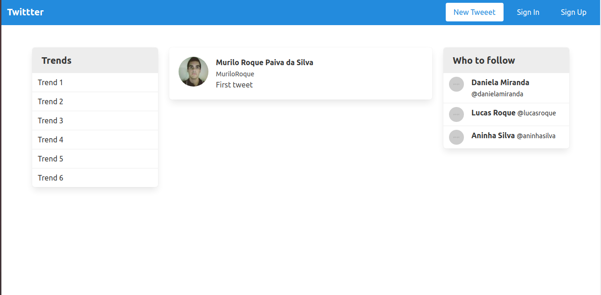

 

# Twitter Clone App

First of all, you can find this project's tutorial [here](https://www.youtube.com/watch?time_continue=1&v=5gUysPm64a4&feature=emb_logo). Credits go to [Andy Leverenz](https://github.com/justalever)

In this project I:

- Used Ruby to implement a [Twitter](https://twitter.com/home?lang=en) clone webpage;
- Used HTML, SASS and Bulma to create the views;
- Used the following gems: Bulma, Devise, Gravatar Image, Simple Form, Better Errors and Guard LiveReload;
- Set up a code linter in the repository;
- Used gitflow;
- Created an effective Ruby code that solved the problem;
- Applied Ruby coding best practices;
- Implemented basic OOP principles;
- Have an organized project structure;
- Used common Ruby patterns;
- Chose a simple solution over a more complex one.

# What it does

When the App is executed, you can sign up and sign out of your account. Also, you can make tweeets, edit and delete them. Only signed in users can see the full webpage.

## Built with

Ruby on Rails, HTML, SASS and Bulma.

## Live Demo

Not avaiable at the moment, it will be in here a future feature.

## Getting Started

- Clone the project to your local machine;
- `cd` into the project directory;
- Run `bundle install` to install the necessary gems;
- Run `rails db:migrate` to create your database columns;
- Run `rails s` to start a server in your computer;
- In your browser address, type the following URL: [localhost:3000](localhost:3000);
- Enjoy the App and its functionalities!

## Author

Murilo Roque Paiva da Silva

Github: [@MuriloRoque](https://github.com/MuriloRoque)

Twitter: [@MuriloRoquePai1](https://twitter.com/MuriloRoquePai1)

Linkedin: [MuriloRoque](https://www.linkedin.com/in/murilo-roque-b1268741/)

## 🤝 Contributing

Contributions, issues and feature requests are welcome! Start by:

- Forking the project
- Cloning the project to your local machine
- `cd` into the project directory
- Run `git checkout -b your-branch-name`
- Make your contributions
- Push your branch up to your forked repository
- Open a Pull Request with a detailed description to the development branch of the original project for a review

## Show your support

Give a ⭐️ if you like this project!

## Acknowledgements

The original design is attributed to [Andy Leverenz](https://github.com/justalever).
